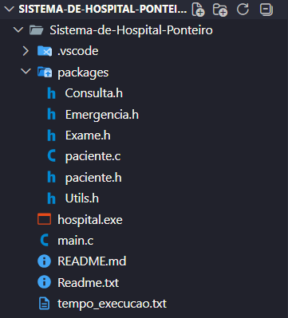

<h1 align="center">
 Sistema de Gerenciamento Hospitalar
</h1>

Sistema desenvolvido em C utilizando estruturas de dados para simular o gerenciamento de pacientes em um hospital.

<h2> Sobre o Projeto</h2>

O sistema realiza o gerenciamento de pacientes através de diferentes setores hospitalares utilizando estruturas de dados clássicas:

<ul>
<li><b>Emergência → Pilha (LIFO)</b></li>
<li><b>Consulta → Fila Simples (FIFO)</b></li>
<li><b>Exame → Fila Circular</b></li>
</ul>

Além do gerenciamento, o sistema permite cadastro, atendimento, transferência de pacientes e geração de relatórios.

<h2>Como compilar:</h2>

No terminal, dentro da pasta execute o seguinte comando abaixo:

gcc main.c packages/paciente.c -o hospital

<h2>Como executar:</h2>

Basta clicar duas vezes no executável "hospital.exe"

<h2> Funcionalidades</h2>

 Cadastro de pacientes 
 Atendimento automático por setor 
 Exibição dos pacientes cadastrados 
 Transferência entre setores 
 Relatórios do hospital 
 Controle de filas 
 Gerenciamento dinâmico de memória 

<h2> Estruturas Utilizadas</h2>

<table>

<tr>
<th>Setor</th>
<th>Estrutura</th>
<th>Funcionamento</th>
</tr>

<tr>
<td>Emergência</td>
<td>Pilha</td>
<td>LIFO (Último a entrar, primeiro a sair)</td>
</tr>

<tr>
<td>Consulta</td>
<td>Fila</td>
<td>FIFO (Primeiro a entrar, primeiro a sair)</td>
</tr>

<tr>
<td>Exame</td>
<td>Fila Circular</td>
<td>Reutilização eficiente do vetor</td>
</tr>

</table>
 

<h2> Tecnologias Utilizadas</h2>

<ul>

<li>Linguagem C</li>

<li>Alocação dinâmica (malloc/free)</li>

<li>Cppcheck</li>

<li>Estruturas de Dados</li>

</ul>

 

<h2> Novas Implementações V2</h2>

<ul>

<li>
Foi realizada a separação das estruturas de <b>Fila</b> e <b>Pilha</b>.
</li>

<li>
As estruturas foram organizadas em arquivos Header separados <b>(.h)</b>.
</li>

<li>
Foram criados ao total <b>5 novos arquivos Header</b> para modularização das estruturas.
</li>

<li>
As constantes do sistema foram movidas para um arquivo <b>Utils.h</b> para facilitar manutenção e acesso.
</li>

<li>
Foi utilizado o <b>Cppcheck</b> para análise estática e verificação de possíveis falhas.
</li>

</ul>

<h2> Bugs Encontrados</h2>

Durante a análise realizada pelo Cppcheck foram encontrados:

<ul>

<li>Possíveis <b>Memory Leaks</b></li>

<li>Problemas de sintaxe e pontos de melhoria</li>

</ul>

Algumas correções foram realizadas visando maior estabilidade do sistema.

<h2> Análise de Tempo</h2>

Foi realizada uma análise de tempo de execução da aplicação.

<h3>Funcionamento:</h3>

<ol>

<li>
Ao iniciar a aplicação é executado o comando <b>clock()</b>, capturando o ciclo atual da CPU.
</li>

<li>
Ao finalizar a aplicação o comando é executado novamente.
</li>

<li>
É calculada a diferença entre o ciclo inicial e o ciclo final.
</li>

<li>
O valor é convertido para segundos.
</li>

<li>
Os resultados são gravados automaticamente em arquivo.
</li>

</ol>

Fórmula utilizada:

<pre>
Tempo Total = (clock_final - clock_inicial) / 1000
</pre>

<h2> Análise de Estresse</h2>

Foi realizada uma análise de estresse do sistema com objetivo de identificar limitações e possíveis falhas sob carga.

<h3>Conclusões:</h3>

<ul>

<li>
O sistema apresentou funcionamento estável durante os testes.
</li>

<li>
Não foram observadas falhas críticas relacionadas às estruturas implementadas.
</li>

<li>
Possíveis problemas podem ocorrer em cenários extremos:
</li>

<ul>
<li>Baixa disponibilidade de memória RAM</li>
<li>Uso excessivo de processamento</li>
</ul>

<li>
A estabilidade está diretamente ligada aos recursos disponíveis na máquina.
</li>

</ul>

<h2> Estrutura do Projeto</h2>

<pre>

Sistema-Hospital/

</pre>

<h2> Relatório do Projeto</h2>

Durante o desenvolvimento do projeto foram utilizadas tecnologias como 
ponteiros, estruturas de dados, modularização de código, cppcheck, 
compilação e organização de ambiente, entre outros recursos fundamentais 
da linguagem C. Essas ferramentas foram importantes para a construção e 
funcionamento do sistema hospitalar, permitindo uma melhor organização do 
código e gerenciamento dos dados do projeto.

<h2> Crítica do Projeto</h2>

A principal dificuldade encontrada pelo grupo foi a adaptação à linguagem C, 
que possui uma complexidade maior quando comparada ao Python, linguagem 
que a maioria dos integrantes já tinha mais familiaridade. O uso de ponteiros 
e o gerenciamento de memória também exigiram maior atenção durante o 
desenvolvimento. Apesar das dificuldades, o projeto contribuiu 
significativamente para o aprendizado lógico e técnico de toda a equipe.

<h2> Integrantes do Grupo</h2>

Desenvolvido por: 

<table width="100%">

<tr>
<td> Beatriz Barboza Marques Lima da Silva</td>
</tr>

<tr>
<td> Davy Queiroz da Silva</td>
</tr>

<tr>
<td>
<b> Hudson Nascimento Pereira Vieira </b>
</td>
</tr>

<tr>
<td> Igor dos Santos Moura</td>
</tr>

<tr>
<td> Matheus Lima Rocha</td>
</tr>

<tr>
<td> Rafael dos Santos Paulo</td>
</tr>

<tr>
<td> Rodrigo Gomes da Conceição</td>
</tr>

</table>

<h2> Repositório do Projeto</h2>

<a href="https://github.com/Hudson-Nasciment0/Sistema-de-Hospital">
Clique aqui para acessar o Sistema de Hospital 
</a>

 

